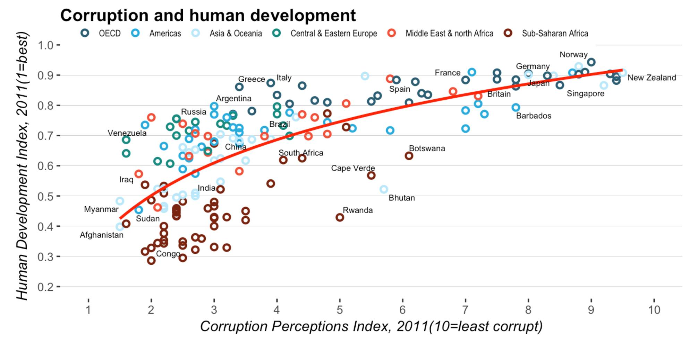

# Introduction to R Graphics with ggplot2 (IQSS)
This is a weekend exercise, using materials from a workshop offered by Harvard University's Institute for Quantitative Social Science (IQSS) program. The original workshop notes can be found on the [IQSS website](http://tutorials.iq.harvard.edu/R/Rgraphics/Rgraphics.html).

*The end result:* 

# Challenge
At the end of the exercise, the workshop presented [a graph on Corruption and Human Development Index](http://www.economist.com/node/21541178) originally created from the Economist and challenge the readers to recreate one as close as possible to the original economist graph. 

# Project structure
The project is completed using R notebook, and exported to both HTML and PDF. All three files (Rmd, HTML and PDF) are available in this repo. At the end of the exercise, I have attempted to re-create the original graph from scratch using only the vanilla ggplot library (without the use of `ggthemes` or other theming library) and in the process showed how we can create a custom theme for our own projects.  
